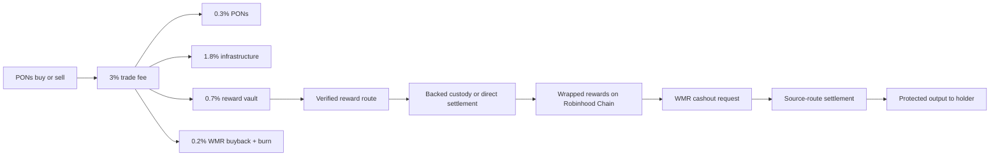

# Architecture

WMR Desks separates trading, accounting, reward execution and settlement so each step can be verified independently.

## Components

### Hosted launch factory

Creates the PONs coin and its dedicated desk in one transaction. The factory records the selected reward asset and installs the fixed fee allocation.

### Desk vault

Receives the launch's creator-fee stream, accounts for each allocation and requests reward purchases. A vault cannot distribute an unfunded amount.

### Reward registry

Maps a stable asset identifier to its source network, backing contract, wrapper and settlement route. A symbol or logo is never sufficient proof of identity.

### Indexer and keeper

The indexer discovers launches and calculates eligible holders at an explicit block. The keeper claims fees, executes purchases, reconciles backing and publishes distribution rounds. Pool, curve, burn, vault and protocol addresses are excluded from holder snapshots.

### Backed wrapper

Represents purchased assets on Robinhood Chain. Minting is constrained by verified settlement or custody. Exiting burns the wrapper and creates a settlement request. Wrappers are standard ERC-20 tokens for discovery, balances and approvals.

### Cashout router

Accepts approved wrapper tokens through `requestSell`, enforces minimum output and deadline protection, and emits a request that the settlement service completes. Some routes require a quoted execution fee in native ETH.

## No wrapper liquidity pools

WMR cashout is a redemption path, not a speculative pool. A wallet or terminal can display a wrapped balance using ERC-20 methods, but it must integrate the cashout router to offer a working Sell or Redeem action. Sending a wrapper to an unrelated DEX does not trigger settlement.

## Chain routes

Robinhood Chain assets can settle directly. Ethereum and BNB Chain use EVM custody and relay routes. Solana uses verified source-chain custody and a backed wrapper. BTC exposure can use a registered canonical EVM asset such as cbBTC when that route is enabled. ZEC requires a dedicated verified route before it can be advertised as redeemable.

Route registration is separate from runtime availability. Applications should check both before accepting a request.

